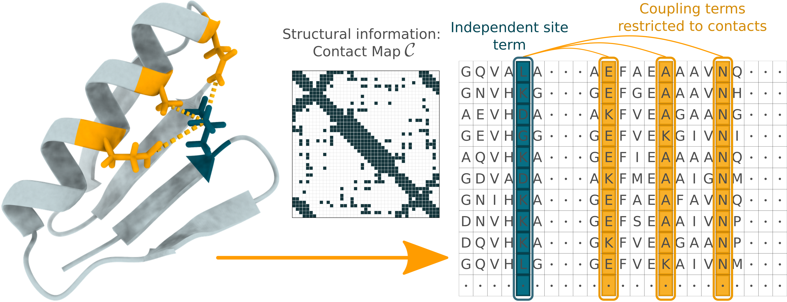

# StructureDCA

[](https://pypi.org/project/structuredca/) [](https://opensource.org/licenses/MIT) [](
https://colab.research.google.com/github/3BioCompBio/StructureDCA/blob/main/colab_notebook_StructureDCA.ipynb)
<div style="text-align: center;">

</div>

The `structuredca` Python package implements **Structure-Informed Direct Coupling Analysis** (StructureDCA) to predict the **effects of missense mutations on proteins**.

Standard DCA methods use **Multiple Sequence Alignments (MSAs)** to build a **statistical evolutionary model** of homologous protein families. They rely on single-site fields `h` and pairwise couplings `J` that capture co-evolution between residue positions.
StructureDCA extends this framework by incorporating the **residue–residue contact map** derived from the protein **3D structure** to infer a **sparse DCA model**, in which couplings between spatially distant residue pairs are removed.
This approach leverages the observation that functionally relevant, co-evolving residues are most often structurally in contact.

The package includes a **pseudolikelihood-maximization DCA solver** capable of inferring sparse DCA models, where selected coupling coefficients `Jij` are constrained to zero.
StructureDCA combines a flexible, user-friendly Python interface with the high computational efficiency of its C++ backend.
This model was initially developed to improve classical DCA methods for predicting the effects of missense mutations in proteins. However, StructureDCA can be applied to any DCA-based analysis (except for contact predictions...) and provides the full functionality of both standard and sparse DCA models.

**Please cite**:
- [Matsvei Tsishyn, Hugo Talibart, Marianne Rooman, Fabrizio Pucci. Structure-informed direct coupling analysis improves protein mutational landscape predictions. BioRxiv](https://www.biorxiv.org/).


## Installation and Usage

### Colab Notebook

You can instantly try StructureDCA in this [Colab Notebook](https://colab.research.google.com/github/3BioCompBio/StructureDCA/blob/main/colab_notebook_StructureDCA.ipynb). This notebook acts as a **user-friendly web server** / **graphical interface**, offering helpers to **automatically fetch or generate the MSA and 3D structure** for your target protein.
You can then **visualize** your mutational landscape predictions as a DMS heatmap or mapped to the 3D structure.

### Installation
Installation with `pip`:
```bash
pip install structuredca
```

### CLI usage
Use StructureDCA with a Command Line Interface (CLI).
For example, from the directory `./test_data/`, run:
```bash
structuredca ./6acv_A_29-94.fasta ./6acv_A_29-94.pdb A -o ./6acv_A_29-94_structuredca.csv
```

To show CLI usage and optional arguments, run:
```bash
structuredca --help
```

### Python usage
Make sure the first sequence in your MSA file is the target sequence to mutate (otherwise have a look at tutorial 1).  
From directory `./test_data/` execute the following Python code:
```python
# Import
from structuredca import StructureDCA

# Log basic usage and arguments
StructureDCA.help()

# Initialize StructureDCA model
sdca = StructureDCA(
    msa_path='./6acv_A_29-94.fasta',
    pdb_path='./6acv_A_29-94.pdb', chains='A',
    use_contacts_plddt_filter=False, # use only if 3D structure is an AlphaFold model (or similar) to remove low pLDDT regions from contacts
)

# Evaluate the evolutionary energy difference (ΔE) of mutations
# scores can be reweighted by Relative Solvent Accessibility-complement (RSAc) -> advised to predict stability changes (ΔΔG)
# * dE = 0 means neutral mutation
# * dE >> 0 means destabilizing / deleterious mutation
dE_mut1 = sdca.eval_mutation('K13H', reweight_by_rsa=True)
dE_mut2 = sdca.eval_mutation('K13H:K12G', reweight_by_rsa=True)

# Evaluate ΔE of all single mutations and save results to a file
dE_all = sdca.eval_mutations_table(
    save_path='./6acv_A_29-94_structuredca.csv',
    log_output_sample=True,
)

# Evaluate absolute evolutionary energy (E) of a sequence
seq_to_evaluate = 'A' * sdca.msa_length # arbitrary example: AAAAA...
E_only_alanine = sdca.eval_sequence(seq_to_evaluate, reweight_by_rsa=True)

# Evaluate relative probabilities for the 20 Amino Acids at this position given a background sequence 
fasta_position = 10 # as in FASTA index system (starts at 1)
array_position = fasta_position - 1 # As in a Python array (starts at 0)
amino_acid_probabilities = sdca.position_probabilities(array_position) # P(a) = e^{-dE(wt→a)} / ∑_b e^{-dE(wt→b)}
```

### Tutorials and Advanced Usage
In the `./tutorials/` directory, we provide a series of Jupyter notebooks that illustrate different ways to using **StructureDCA**:

1. **Basics and arguments** (`1_sdca-basics.ipynb`): basics, evaluating effects of mutations with StructureDCA, using optional arguments (like `distance_cutoff` or `lambda_h` / `lambda_J`), evaluate mutations with an alternative background sequence.

2. **Access properties** (`2_sdca-properties.ipynb`): access StructureDCA coefficients and properties (like fields `h`, couplings `J`, Frobenius norms, residue-residue distance matrix, contact map, ...).

3. **Standard DCA** (`3_sdca-standard-dca.ipynb`): solve standard (fully connected) DCA models and run without protein 3D structure. 

4. **Protein–Protein Interactions** (`4_sdca-ppis.ipynb`): working with protein–protein interactions (PPIs).  
Compute RSA from the biologically relevant conformation, include inter-chain contacts arising from homomers, and build a StructureDCA model from a concatenated MSA of a heteromer PPI of highly coevoling proteins.

5. **Custom contacts** (`5_sdca-custom-contacts.ipynb`): build a StructureDCA model with custom contact map (instead of the default distance criteria) and custom weights for StructureDCA[RSA] (instead of default RSA-based weights) to derive any possible sparse DCA model.

## Build and Installation Notes

### Requirements
- Python 3.9 or later
- Python packages `numpy` and `biopython` (version 1.75 or later)
- A C++ compiler that supports C++17 (such as GCC, LLVM or MSVC).

## Credits
- For inferring the DCA coefficients, StructureDCA uses a gradient descent solver: [L-BFGS](https://github.com/chokkan/liblbfgs "libLBFGS") by Naoaki Okazaki (which is included in this repo).
- The part of the code that makes the bridge between Python and C++ is inspired from the [plmDCA implementation 'pycofitness'](https://github.com/KIT-MBS/pycofitness/) by Mehari B. Zerihun, Fabrizio Pucci.
